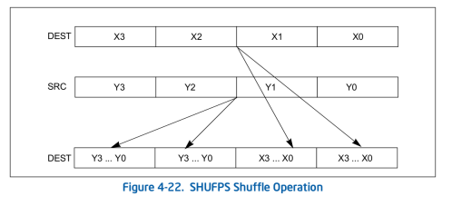

#### ASM - C
+ [void*] 64 bits, 8 bytes. Addr direccionable.
+ [char] 8 bits, 1 byte
+ [int8\_t] 8 bits, 1 byte
+ [int] 32 bits, 4 bytes
+ [int32\_t] 32 bits, 4 bytes
+ [float] 32 bits, 4 bytes
+ [float] bit sign, exponent, significand
+ [double] 64 bits, 4 bytes
+ [byte / b]  1 byte 8 bits
+ [word / w] 2 bytes 16 bits
+ [dword / dw] 4 bytes 32 bits
+ [qword /qw]  8 bytes 64 bits
+ [xmms] 128 bits, 16 bytes
+ [xmms] 4 floats, 2 double, 4 unsigned int, 4 int
+ [0xFF] 8 bits, 1 byte
+ [direcc] [reg+reg*scalar+desp], scalar=1,2,4,8 desp=imm32bits

## Definiendo en memoria
```
movdqu xmm1, [mem]; levanta desalineado

movdqa xmm2, [mem]; operand must be aligned on a 16-byte boundary or a general-protection exception (#GP) will be generated
DEST[127:0] ← SRC[127:0]

etiqueta: DD 0, 0xFFFFFFFF, 0, 0xFFFFFFFF
movdqu , [etiqueta] ;  = [0xFFFFFFFF,0,0xFFFFFFFF,0]

enteros_byte: DB 0x00, 0xFF, 0x01, 0xFF, 0x02, 0xFF, 0x03, 0xFF, 0x00, 0xFF, 0x01, 0xFF, 0x02, 0xFF, 0x03, 0xFF ; x 16
enteros_uint16: DW	0, -208, -100	, 298,	0, 409	, 0		, 298 ; enteros de 16 bits x 8
doublewords: DD 128,  0,  0,  0 ; puntos flotante single pre x 4

Stack (ponele que alineado a 64):
p1 - p0 --> Dirección mas ba|a
p3 - p2 --> Dirección mas alta

movdqu xmm0, [rdi]; xmm0 = [P3 | P2 | P1 | P0]
```
## EMPAQUETADO
```

Empaquetado: pack + ss/us + wb/dw
Empaquetado: pack + ss/us + wb/dw

packsswb (saturacion con signo)
packuswb (saturacion sin signo)

```

## DESEMPAQUETADO
```
Desempaquetado: punpck + l/h + bw/wd/dq/qdq

```

## Operaciones aritmeticas SIMD
```

pavgb (promedio)

sqrtps (raiz cuadrada)

Flotante:

  Multiplicacion:

  Empaquetado MULPS / MULPD
  MULPS xmm1, xmm2/m128
  Multiply packed single-precision floating-point values in xmm2/mem by xmm1.

  Desempaquetado MULSS/ MULSD
  MULSS xmm1, xmm2/m32 (UN SOLO VALOR)
  Multiply the low single-precision floating-point value in xmm2/mem by the low single-precision floating-point value in xmm1.

  Division:
  DIVPS xmm1, xmm2/m128

  Suma:
  addps
  subps

Entero:
  Suma:
  paddb
  paddw
  paddd
  paddq

  resta:
  psubb
  psubw
  psubd


Mayor:
xmm1 = 1000 / -456 / -15 / 0 / 100 / 234 / -890 / 1
xmm7 = 0.
pcmpgtw xmm7, xmm1 ; xmm7 > xmm1 ?
xmm7 = 0x0000 , 0xFFFF , 0xFFFF , 0x0000 , 0x0000 , 0x0000 , 0xFFFF , 0x0000

Extender el signo:
Aprovechando que los numeros negativos se extendienden con 1s, y
los positivos con 0s. Por e|emplo:
-5 = 1011 se extiende a 1111 1011
5 = 0101 se extiende a 0000 0101

pcmpgtw xmm7, xmm1 ; xmm7 > xmm1 ?
movdqu xmm2, xmm1 ; copio xmm1
punpckhwd xmm1, xmm7 ; xmm1 = 1000 / -456 / -15 / 0
punpcklwd xmm2, xmm7 ; xmm2 = 100 / 234 / -890 / 1


Generar mascaras:
Muy utiles para ltrar, enmascarar, o lo que necesitemos hacer solo
a algunos elementos del registro. Utilizamos ademas instrucciones
como PAND, POR, PXOR, etc.
```

## Operaciones logicas SIMD
```
pandn xmm1, xmm2/m128 ;packed and not
pxor xmm1, xmm2/m128;packed xor
por xmm1, xmm2/m128;packed or
pand xmm1, xmm2/m128;packed and
Destination = Destination & Source;
```


## Conversiones

```
Las instrucciones de conversion son de la forma: cvtxx2yy
Donde xx e yy pueden valer:
ps - Packed Single FP pd - Packed Double FP pi - Packed Integer
ss - Scalar Single FP sd - Scalar Double FP si - Scalar Integer
dq - Packed Dword

CVTSD2SI - Scalar Double FP to Dword Integer
CVTSD2SI r32, xmm/m64 | CVTSD2SI r64, xmm/m64

CVTSI2SD - Dword Integer to Scalar Double FP
CVTSI2SD xmm, r/m32 | CVTSI2SD xmm, r/m64

CVTDQ2PS - Packed Dword Integers to Packed Single FP (4X)
CVTDQ2PS xmm1, xmm2/m128

CVTPS2DQ - Packed Single FP to Packed Dword Integers (4X)
CVTPS2DQ xmm1, xmm2/m128

CVTDQ2PD - Packed Dword Integers to Packed Double FP (2X)
CVTDQ2PD xmm1, xmm2/m64

CVTPD2DQ - Packed Double FP to Packed Dword Integers (2X)
CVTPD2DQ xmm1, xmm2/m128

CVTPD2PS - Packed Double FP to Packed Single FP (2X)
CVTPD2PS xmm1, xmm2/m128

CVTPS2PD - Packed Single FP to Packed Double FP (2X)
CVTPS2PD xmm1, xmm2/m64

CVTSD2SS - Scalar Double FP to Scalar Single FP (1X)
CVTSD2SS xmm1, xmm2/m64

CVTSS2SD - Scalar Single FP to Scalar Double FP (1X)
CVTSS2SD xmm1, xmm2/m32

CVTTPS2DQ - Truncation Packed Single FP to Packed Dword Int. (4X)
CVTTPS2DQ xmm1, xmm2/m128

CVTTSS2SI - Truncation Scalar Single FP to Dword Integer (1X)
CVTTSS2SI r32, xmm/m32

CVTTSD2SI - Truncation Scalar Double FP to Signed Integer (1X)
CVTTSD2SI r32, xmm/m64

CVTSI2SS - Dword Integer to Scalar Single FP
CVTSI2SS xmm, r/m32

CVTSS2SI - Scalar Single FP to Dword Integer
CVTSS2SI r32, xmm/m32

CVTPI2PS - Packed Dword Integers to Packed Single FP (2X)
CVTPI2PS xmm, mm/m64

CVTPI2PD - Packed Dword Integers to Packed Double FP (2X)
CVTPI2PD xmm, mm/m64

ROUNDPS - Round Packed Single FP to Integer (4X)
ROUNDPS xmm1, xmm2/m128, imm8

ROUNDSS - Round Scalar Single FP to Integer
ROUNDSS xmm1, xmm2/m32, imm8

ROUNDPD - Round Packed Double FP to Integer (2X)
ROUNDPD xmm1, xmm2/m128, imm8

ROUNDSD - Round Scalar Double FP to Integer
ROUNDSD xmm1, xmm2/m64, imm8
```

## INSERT - EXTRACT
+ INSERTPS - Insert Packed Single FP Value
+ EXTRACTPS - Extract Packed Single FP Value
+ PINSRB - Insert Byte
+ PINSRW - Insert Word
+ PINSRD - Insert Dword
+ PINSRQ - Insert Qword
+ PEXTRB - Extract Byte
+ PEXTRW - Extract Word
+ PEXTRD - Extract Dword
+ PEXTRQ - Extract Qword

####

```
PINSRB xmm1, r32/m8, imm8
Insert a byte integer value from r32/m8 into xmm1 at the destination element in xmm1 specified by imm8.

PINSRD xmm1, r/m32, imm8
Insert a dword integer value from r/m32 into the xmm1 at the destination element specified by imm8.

 PINSRQ xmm1, r/m64, imm8
 Insert a qword integer value from r/m64 into the xmm1 at the destination element specified by imm8.

CASE OF
    PINSRB:
              SEL ← COUNT[3:0];
              MASK ← (0FFH << (SEL * 8));
              TEMP ← (((SRC[7:0] << (SEL *8)) AND MASK);
    PINSRD:
              SEL ← COUNT[1:0];
              MASK ← (0FFFFFFFFH << (SEL * 32));
              TEMP ← (((SRC << (SEL *32)) AND MASK)
                                                              ;
    PINSRQ:
              SEL ← COUNT[0]
              MASK ← (0FFFFFFFFFFFFFFFFH << (SEL * 64));
              TEMP ← (((SRC << (SEL *64)) AND MASK)
                                                              ;
ESAC;

DEST ← ((DEST AND NOT MASK) OR TEMP);


PINSRW xmm, r32/m16, imm8

Masks[] = {
	0x0000000000000000000000000000FFFF,
	0x000000000000000000000000FFFF0000,
	0x00000000000000000000FFFF00000000,
	0x0000000000000000FFFF000000000000,
	0x000000000000FFFF0000000000000000,
	0x00000000FFFF00000000000000000000,
	0x0000FFFF000000000000000000000000,
	0xFFFF0000000000000000000000000000
};
SEL = Count & 7;
Mask = Masks[SEL];
Destination = (Destination & ~Mask) | (((Source << (SEL * 16)) & Mask);
```
### insert single

```
INSERTPS xmm1, xmm2/m32, imm8

IF (SRC = REG)
	COUNT_S = imm8[7:6];
ELSE
	COUNT_S = 0;
FI;

COUNT_D = imm8[5:4];

ZMASK = imm8[3:0];

CASE (COUNT_S) OF
	0: TMP = SRC[31:0]; // --> si es registro de 32 o 0 en bit 7/8 de imm8
	1: TMP = SRC[63:32];
	2: TMP = SRC[95:64];
	3: TMP = SRC[127:96];
ESAC;

//TMP tiene aca 32 bits de SRC

CASE (COUNT_D) OF
	0: TMP2[31:0] = TMP;
	TMP2[127:32] = DEST[127:32];
	1: TMP2[31:0] = DEST[31:0];
  TMP2[63:32] = TMP;
	TMP2[127:64] = DEST[127:64];
	2: TMP2[95:64] = TMP;
	TMP2[63:0] = DEST[63:0];
	TMP2[127:96] = DEST[127:96];
	3:TMP2[95:0] = DEST[95:0];
  TMP2[127:96] = TMP;
ESAC;

// TMP2 es un registro de 128
// contiene el original y en algun lado el pedacito tmp. 0 a 3 del pedacito

IF (ZMASK[0] = 1)
	DEST[31:0] = 00000000H;
ELSE
	DEST[31:0] = TMP2[31:0];
	IF (ZMASK[1] = 1)
		DEST[63:32] = 00000000H;
	ELSE
		DEST[63:32] = TMP2[63:32];
		IF (ZMASK[2] = 1)
			DEST[95:64] = 00000000H;
		ELSE
			DEST[95:64] = TMP2[95:64];
			IF (ZMASK[3] = 1)
				DEST[127:96] = 00000000H;
			ELSE
				DEST[127:96] = TMP2[127:96];
			FI;
		FI;
	FI;
FI;

//0 a 3 bits, si esta en 0 pone en 0 ese dw
// E|emplo de imm0 :
 0xF(de|a bits ok como estaban) or
(0x2 << 4) or lo pongo en la 3era posicion
(0x3 << 6) tomo los 32 mas significativos de src

```

#### Extract single p

```

EXTRACTPS reg/m32, xmm2, imm8

basicamente te pone en un registro el inmediato (4 posibilidades del xmm)
Single pre es DW (4 bytes * imm8 posibilidades 0 a 3)

SRC_OFFSET ← IMM8[1:0]
IF ( 64-Bit Mode and DEST is register)
    DEST[31:0] ← (SRC[127:0] » (SRC_OFFET*32)) AND 0FFFFFFFFh
    DEST[63:32] ← 0
ELSE
    DEST[31:0] ← (SRC[127:0] » (SRC_OFFET*32)) AND 0FFFFFFFFh
FI

```

## SHUFFLES

#### Shuffle packed single FP values
```
SHUFPS xmm1, xmm3/m128, imm8

Basicamente en un registro de 128 pone la parte ba|a 2 de 32 del original
y en la parte alta 2 de 32 del xmm3

y la parte alta le pone los altos o ba|os del SRC

DEST[31:0] Select4(DEST[127:0], imm8[1:0]);
DEST[63:32] Select4(DEST[127:0], imm8[3:2]);
DEST[95:64] Select4(SRC[127:0], imm8[5:4]);
DEST[127:96] Select4(SRC[127:0], imm8[7:6]);
DEST[MAX_VL-1:128] (Unmodified)

////

switch(Select[0..1]) {
	case 0:
		Destination[0..31] = Destination[0..31];
		break;
	case 1:
		Destination[0..31] = Destination[32..63];
		break;
	case 2:
		Destination[0..31] = Destination[64..95];
		break;
	case 3:
		Destination[0..31] = Destination[96..127];
		break;
}
switch(Select[2..3]) {
	case 0:
		Destination[32..63] = Destination[0..31];
		break;
	case 1:
		Destination[32..63] = Destination[32..63];
		break;
	case 2:
		Destination[32..63] = Destination[64..95];
		break;
	case 3:
		Destination[32..63] = Destination[96..127];
		break;
}
switch(Select[4..5]) {
	case 0:
		Destination[64..95] = Source[0..31];
		break;
	case 1:
		Destination[64..95] = Source[32..63];
		break;
	case 2:
		Destination[64..95] = Source[64..95];
		break;
	case 3:
		Destination[64..95] = Source[96..127];
		break;
}
switch(Select[6..7]) {
	case 0:
		Destination[96..127] = Source[0..31];
		break;
	case 1:
		Destination[96..127] = Source[32..63];
		break;
	case 2:
		Destination[96..127] = Source[64..95];
		break;
	case 3:
		Destination[96..127] = Source[96..127];
		break;
}

```


#### Shuffle packed single DP values
```
SHUFPD xmm1, xmm2/m128, imm8
Basicamente en un registro de 128 pone la parte ba|a (64) con los
valores del destino altos o ba|os
y la parte alta le pone los altos o ba|os del SRC


if(Select[0] == 0)
  Destination[0..63] = Destination[0..63];
else
  Destination[0..63] = Destination[64..127];
if(Select[1] == 0)
  Destination[64..127] = Source[0..63];
else
  Destination[64..127] = Source[64..127];
```

#### Shuffle de a bytes (1 byte - 8 bits - 16 posibilidades)
```
pshufb xmm1, xmm2 ; m128

for i = 0 ; i < 15 ; i++ {
 COPIA = XMM1
 if MM2/m128[i*8 +7] = 1 {
   ;Chequea ultimo bit de un byte
     XMM1[i*8+7 .. i*8+0] = 0
       ;Todo ese byte es 0
   } else {
   index[3..0] = MM2/128[i*8+3..i*8+0]

   XMM1[i*8+7..i*8+0] = COPIA[index*8+7..index*8+0]
   }
}
```


#### Shuffle de a words (2 bytes - 16 bits - 4 posibilidades de posicion parte ba|a)

```
pshufw mm1, mm2/m64, imm8
Shuffle the words in mm2/m64 based on the encoding in imm8 and store the result in mm1.
Destination[0..15] = (Source >> (Order[0..1] * 16))[0..15];
Destination[16..31] = (Source >> (Order[2..3] * 16))[0..15];
Destination[32..47] = (Source >> (Order[4..5] * 16))[0..15];
Destination[48..63] = (Source >> (Order[6..7] * 16))[0..15];

imm8 0 MASK: (8 bits) > 00 00 00 00 o bien 0x00
shiftea en cada caso el SRC (mm2/64) y lo pone en el dest correspondiente.
00 * 16 = 0
01 * 16 = 16
10 * 16 = 32
11 * 16 = 64

```

#### Shuffle de a words h/l

```
PSHUFHW xmm1, xmm2/m128, imm8

PSHUFHW (128-bit Legacy SSE version)
DEST[63:0]  SRC[63:0]
DEST[79:64]  (SRC >> (imm[1:0] *16))[79:64]
DEST[95:80]  (SRC >> (imm[3:2] * 16))[79:64]
DEST[111:96]  (SRC >> (imm[5:4] * 16))[79:64]
DEST[127:112]  (SRC >> (imm[7:6] * 16))[79:64]
DEST[VLMAX-1:128] (Unmodified)

PSHUFLW xmm1, xmm2/m128, imm8

PSHUFLW (128-bit Legacy SSE version)
DEST[15:0]  (SRC >> (imm[1:0] *16))[15:0]
DEST[31:16]  (SRC >> (imm[3:2] * 16))[15:0]
DEST[47:32]  (SRC >> (imm[5:4] * 16))[15:0]
DEST[63:48]  (SRC >> (imm[7:6] * 16))[15:0]
DEST[127:64]  SRC[127:64]
DEST[VLMAX-1:128] (Unmodified)
```

#### Shuffle de a dwords
```
PSHUFD xmm1, xmm2/m128, imm8
imm8 = order
src = xmm2/m128
dst = xmm1

PSHUFD (128-bit Legacy SSE version)
DEST[31:0]  (SRC >> (ORDER[1:0] * 32))[31:0];
DEST[63:32]  (SRC >> (ORDER[3:2] * 32))[31:0];
DEST[95:64]  (SRC >> (ORDER[5:4] * 32))[31:0];
DEST[127:96]  (SRC >> (ORDER[7:6] * 32))[31:0];
DEST[VLMAX-1:128] (Unmodified)
```

## Super ejemplo aritmetico SIMD.
```
// Util con matriz
mov rdi, r13 ; rdi = n
shl rdi, 2 ; rdi = n * 4
call malloc ; pido memoria (n*4)


;Preparamos los registros para el ciclo y buscamos dentro del vector el
;maximo y el mnimo

mov rcx, r13 ; rcx = n
shr rcx, 2 ; rcx = n / 4 ; esto porque va a iterar de a 4 elementos.

mov rdi, r12 ; rdi = vector
movups xmm0, [rdi] ; xmm0 = valores iniciales para mnimos
movups xmm1, [rdi] ; xmm1 = valores iniciales para maximos

.ciclo:
  movups xmm2, [rdi] ; ba|o 4 valores
  minps xmm0, xmm2 ; xmm0 = mnimos actualizados
  maxps xmm1, xmm2 ; xmm1 = maximos actualizados
  add rdi, 16 ; avanzo el puntero
  loop .ciclo
;Consigo el mnimo de los mnimos en xmm0 y lo \replico" en cada
;posicion de xmm0:

movdqu xmm2, xmm0 ; xmm2 = xmm0
psrldq xmm2, 4 ; xmm2 = 0 |xmm03 |xmm02 |xmm01
minps xmm0, xmm2 ; xmm0 = ? | min(xmm02;xmm03) | ? | min(xmm00;xmm01)
movdqu xmm2, xmm0
psrldq xmm2, 8 ; xmm2 = 0 | 0 |?| min(xmm02;xmm03)
minps xmm2, xmm0 ; xmm2 = ? |?|?|min(xmm00;xmm01;xmm02;xmm03)
xorps xmm0, xmm0 ; xmm0 = 0 | 0 | 0 | 0
addss xmm0, xmm2 ; xmm0 = 0 | 0 | 0 | min
pslldq xmm0, 4 ; xmm0 = 0 | 0 | min | 0
addss xmm0, xmm2 ; xmm0 = 0 | 0 | min | min
movaps xmm3, xmm0 ; xmm3 = 0 | 0 | min | min
pslldq xmm3, 8 ; xmm3 = min | min | 0 | 0
addps xmm0, xmm3 ; xmm0 = min | min | min | min

movdqu xmm2, xmm1 ; xmm2 = xmm1
psrldq xmm2, 4 ; xmm2 = 0 |xmm13 |xmm12 |xmm11
maxps xmm1, xmm2 ; xmm1 = ? | max(xmm12;xmm13) | ? | max(xmm10;xmm11)
movdqu xmm2, xmm1
psrldq xmm2, 8 ; xmm2 = 0 | 0 |?| max(xmm12;xmm13)
maxps xmm2, xmm1 ; xmm2 = ?|?|?|max(xmm10;xmm11;xmm12;xmm13)
xorps xmm1, xmm1 ; xmm1 = 0 | 0 | 0 | 0
addss xmm1, xmm2 ; xmm1 = 0 | 0 | 0 | max
pslldq xmm1, 4 ; xmm1 = 0 | 0 | max | 0
addss xmm1, xmm2 ; xmm1 = 0 | 0 | max | max
movaps xmm3, xmm1 ; xmm3 = 0 | 0 | max | max
pslldq xmm3, 8 ; xmm3 = max | max | 0 | 0
addps xmm1, xmm3 ; xmm1 = max | max | max | max
subps xmm1, xmm0 ; xmm1 = (max - min) | (max - min) | (max - min) | (max - min)

mov rcx, r13 ; rcx = n
shr rcx, 2 ; rcx = n / 4
mov rdi, r12 ; rdi = v
mov rsi, rax ; rsi = vector nuevo

.ciclo2:
  movups xmm2, [rdi] ; xmm2 = Xi+3 j Xi+2 j Xi+1 j Xi
  subps xmm2, xmm0 ; xmm2 = Xi+3 - min ..... Xi - min
  divps xmm2, xmm1 ; xmm2 = Xi+3 - min/max-min ..... Xi - min / max-min
  movups [rsi], xmm2 ; escribo los valores normalizados al nuevo vector
  add rdi, 16 ; avanzo punteros
  add rsi, 16
  loop .ciclo2
pop r13
pop r12
pop rbp
ret
```
